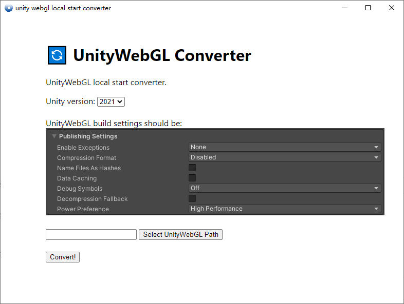
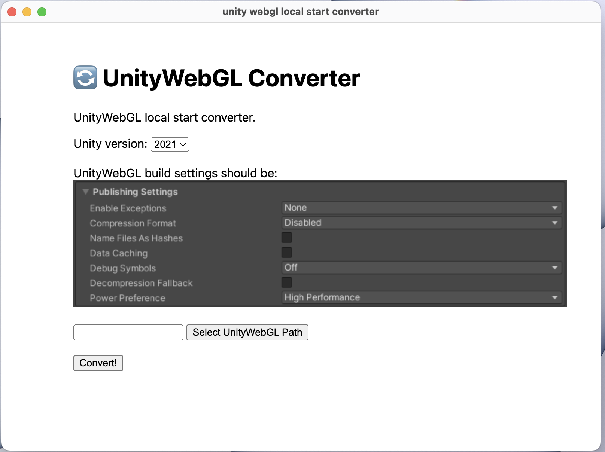

# unity_webgl_local_start_converter
Convert the webgl built by unity to a version that can be directly started locally without a server

# compatibility 
- windows √
- macOS √
- Unity 2021 √ (Currently only supports unity2021)

# app
- windows

- macOS

- dependency
    - electron-forge
    <!-- - prettier --> 

# download
[click to download](https://github.com/PMZeroSkyline/unity_webgl_local_start_converter/releases)

# how to use
First build unity webgl, please make sure that the publishing settings of unity are the same as the figure, use this software to select the webgl folder built by unity, and click convert. Now you can open locally

# compiling
- install dependencies
`
npm install
`

- run
`
npm start
`

- build
`
npm run make
`